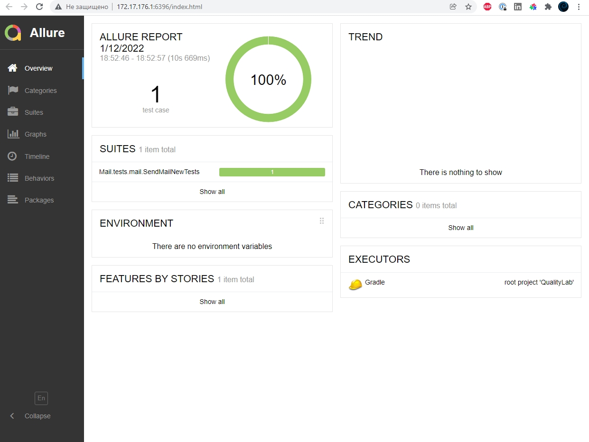
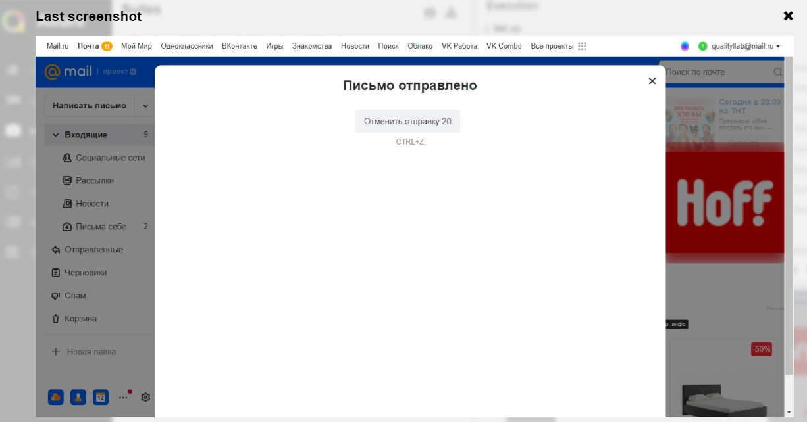

> В данном проекте автотесты написаны на <code>Java</code> с использованием фреймворка <code>Selenide</code> для UI-тестов и реализованы pageObject.
>
> <code>Allure Report</code> формирует отчет о запуске тестов.
>
> Для автоматизированной сборки проекта используется <code>Gradle</code>.
>
> В качестве библиотеки для модульного тестирования используется <code>JUnit 5</code>.

### Локальный запуск тестов

```
1.Запустить из терминала команду gradle clean
2.Запустить из терминала команду gradle mail_test (тесты запустятся в браузере Chrome)
3.Запустить из терминала команду gradle downloadAllure, дождаться завершения команды
4.Запустить из терминала команду gradle allureServe, запуститься браузер с локальным Allure, в котором будет отчёт о тестах.
```
> [**Allure-framework**] используется в качестве инструмента для построения отчетов о прогоне автотестов.
> Он позволяет получить информацию о ходе выполнения тестов, а также прикрепить скриншоты, логи к формируемому отчету.

###  Результаты запуска тестов

<p align="center">

</p>

<p align="center">

</p>
